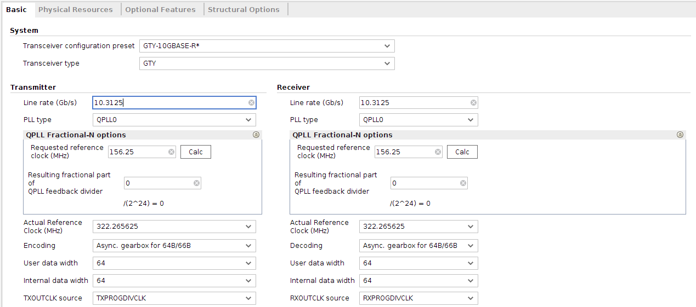
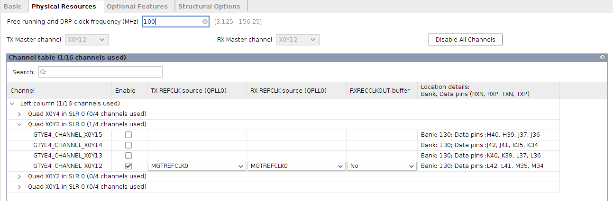

# UltraScale FPGAs Transceivers Wizard Setup

## IP Configuration

The IP requires some modifications from default configuration. Modify fields to match configuration shown in Figures 0 and 1. Any fields not shown do not need modification from default configuration.

Figure 0. Basic Settings

Figure 1. Physical Resources Settings

## Example Design Generation

When IP configuration is finished, right click the generated IP and select "Open Example Design...".

## Top Level Modifications

The top level file of the example design requires modification for general use. See patch file [gtwizard_ultrascale_0_example_top.v](gtwizard_ultrascale_0_example_top.v).
